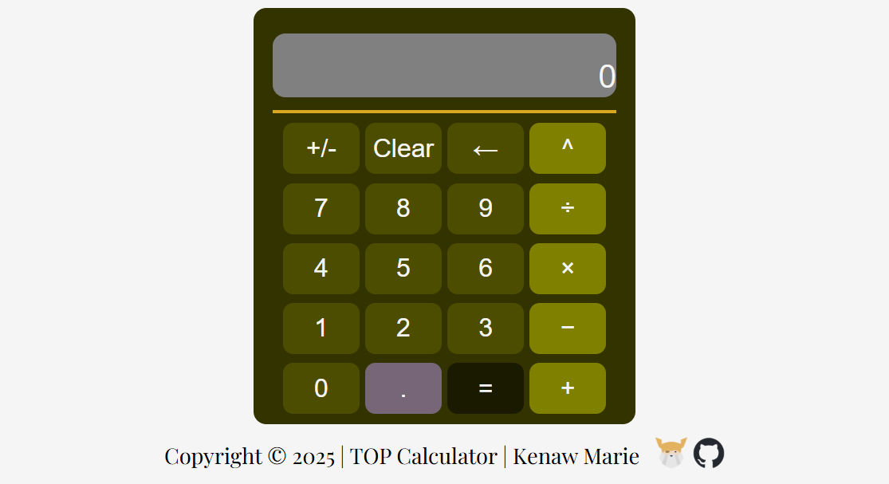

# The Odin Project(TOP) - Calculator

## Table of contents

  - [Overview](#overview)
  - [Screenshot](#screenshot)
  - [Links](#links)
  - [Built with](#built-with)
  - [Author](#author)
  - [Acknowledgments](#acknowledgments)

## Overview

This is a solution to the [The Odin Project: calculator project](https://www.theodinproject.com/lessons/foundations-calculator). 

### Screenshot

### Links

- Live Site URL: [Calculator](https://kenawmarie.github.io/Odin-Calculator/)

### Built with

- html
- CSS
- Javascript

## Author
- Kenaw Marie
- The Odin Project - [@kenawMarie](https://www.theodinproject.com/dashboard)

## Acknowledgments

my special thanks goes to first to [The Odin Project](https://www.theodinproject.com/) and then [Free Code Camp](https://www.freecodecamp.org/).